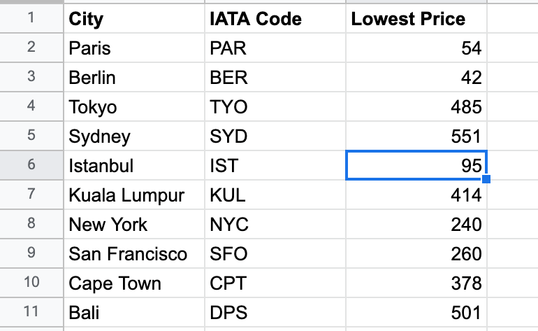

This programs pulls data from the Tequila API and compares prices for round_trip flights from London and a small number 
of other large cities around the world, listed on a Google sheet retrieved through Sheety.

Once the program finds a flight at a price lower than what is listed on the sheet, the user is then sent 
both a text from a Twilio phone number (containing the destination, price and dates), as well as an email including the 
latter as well as a Google flight link to view the flight in more detail.

The Google Sheet the program is using to find flights for:

Examples of the email and texts you might receive: 

To run it yourself with your own custom data, you would need to use the Sheety API, Tequila API, as well as a 
Twilio account. All are free or have the option for a free/ trial account.
Links: 

https://sheety.co/

https://tequila.kiwi.com/portal/login

https://www.twilio.com/